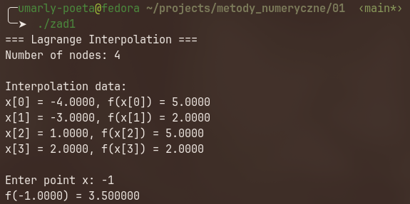

# Sprawozdanie - Laboratorium 1

## Metody Numeryczne

**Autor:** Patryk Kozłowski  
**Kierunek:** ITE, II rok  
**Numer albumu:** 422434  

---

## Zadanie 1 – Interpolacja Lagrange'a na podstawie danych z pliku

### Opis zadania

Celem zadania było zaimplementowanie interpolacji wielomianowej metodą Lagrange'a. Program wczytuje węzły interpolacji z pliku `dane.txt`, a następnie oblicza wartość wielomianu interpolacyjnego w podanym przez użytkownika punkcie $x$.

### Wzór interpolacyjny Lagrange'a

$$L(x) = \sum_{i=0}^{n-1} f(x_i) \prod_{\substack{j=0 \\ j \neq i}}^{n-1} \frac{x - x_j}{x_i - x_j}$$

### Dane wejściowe (`dane.txt`)

```
4 2
-4.0 5.0 
-3.0 2.0
1.0 5.0
2.0 2.0
```

Plik zawiera 4 węzły interpolacji:

| $i$ | $x_i$ | $f(x_i)$ |
|-----|--------|-----------|
| 0   | -4.0   | 5.0       |
| 1   | -3.0   | 2.0       |
| 2   | 1.0    | 5.0       |
| 3   | 2.0    | 2.0       |

### Kod źródłowy (`main.cpp`)

```cpp
#include "../utils/import_from_file.cpp"
#include <iostream>
#include <vector>
#include <iomanip>

using namespace std;

double interpolate(vector<double> X, vector<double> f_X, double xi, int N) {
    double result = 0;

    for (int i = 0; i < N; i++) {
        double term = f_X[i];

        for (int j = 0; j < N; j++) {
            if (j != i) {
                term = term * (xi - X[j]) / (X[i] - X[j]);
            }
        }

        result += term;
    }

    return result;
}

int main() {
    std::pair<std::pair<int,int>, std::vector<std::pair<double, double>>> data = 
        utils::read_typed_file("dane.txt");

    int N = data.first.first;

    vector<double> X;
    vector<double> f_X;
    
    for (auto d : data.second) {
        X.push_back(d.first);
        f_X.push_back(d.second);
    }

    cout << "=== Lagrange Interpolation ===" << endl;
    cout << "Number of nodes: " << N << endl;
    cout << "\nInterpolation data:" << endl;
    for (int i = 0; i < N; i++) {
        cout << "x[" << i << "] = " << fixed << setprecision(4) << X[i] 
             << ", f(x[" << i << "]) = " << f_X[i] << endl;
    }

    double xi;
    cout << "\nEnter point x: ";
    cin >> xi;

    cout << "f(" << xi << ") = " << fixed << setprecision(6) 
         << interpolate(X, f_X, xi, N) << endl;

    return 0;
}
```

### Wyniki działania programu

Dla $x = 0.5$:

```
=== Lagrange Interpolation ===
Number of nodes: 4

Interpolation data:
x[0] = -4.0000, f(x[0]) = 5.0000
x[1] = -3.0000, f(x[1]) = 2.0000
x[2] = 1.0000, f(x[2]) = 5.0000
x[3] = 2.0000, f(x[3]) = 2.0000

Enter point x: f(0.5000) = 5.281250
```

Dla $x = -1.0$:

```
=== Lagrange Interpolation ===
Number of nodes: 4

Interpolation data:
x[0] = -4.0000, f(x[0]) = 5.0000
x[1] = -3.0000, f(x[1]) = 2.0000
x[2] = 1.0000, f(x[2]) = 5.0000
x[3] = 2.0000, f(x[3]) = 2.0000

Enter point x: f(-1.0000) = 3.500000
```




---

## Zadanie 2 – Przybliżenie pierwiastka sześciennego metodą interpolacji Lagrange'a

### Opis zadania

Celem zadania było obliczenie przybliżonej wartości $\sqrt[3]{50}$ za pomocą interpolacji Lagrange'a. Jako węzły interpolacji wykorzystano wartości sześcianów liczb naturalnych: $27, 64, 125, 216$ (tj. $3^3, 4^3, 5^3, 6^3$), a odpowiadające im wartości funkcji to ich pierwiastki sześcienne: $3, 4, 5, 6$.

### Węzły interpolacji

| $i$ | $x_i$ | $f(x_i) = \sqrt[3]{x_i}$ |
|-----|--------|---------------------------|
| 0   | 27     | 3                         |
| 1   | 64     | 4                         |
| 2   | 125    | 5                         |
| 3   | 216    | 6                         |

### Kod źródłowy (`pierwiastek.cpp`)

```cpp
#include <iostream>
#include <vector>
#include <iomanip>
#include <cmath>

using namespace std;

double interpolate(vector<double> X, vector<double> f_X, double xi, int N) {
    double result = 0;

    for (int i = 0; i < N; i++) {
        double term = f_X[i];

        for (int j = 0; j < N; j++) {
            if (j != i) {
                term = term * (xi - X[j]) / (X[i] - X[j]);
            }
        }

        result += term;
    }

    return result;
}

int main() {
    vector<double> X;
    vector<double> f_x;
    double xi_c = 50; 

    X.push_back(27.0);
    X.push_back(64.0);
    X.push_back(125.0);
    X.push_back(216.0);

    for (int i = 0; i < 4; i++) {
        f_x.push_back(pow(X[i], 1.0 / 3.0));  
    }

    int N = 4;

    cout << fixed << setprecision(6) << interpolate(X, f_x, xi_c, N) << endl;
}
```

### Wynik działania programu

```
3.665882
```

Wartość dokładna $\sqrt[3]{50} \approx 3.684031$.


---

## Wnioski

1. **Interpolacja Lagrange'a** jest prostą i skuteczną metodą przybliżania wartości funkcji na podstawie znanych węzłów interpolacji.
2. W **Zadaniu 1** wielomian interpolacyjny stopnia 3 (4 węzły) poprawnie przybliżał wartości funkcji w zakresie danych węzłów.
3. W **Zadaniu 2** zastosowano interpolację do przybliżenia wartości pierwiastka sześciennego z 50, korzystając z węzłów opartych na sześcianach liczb naturalnych.
4. Metoda Lagrange'a jest szczególnie użyteczna, gdy posiadamy dyskretny zbiór punktów i chcemy oszacować wartość funkcji między nimi.
