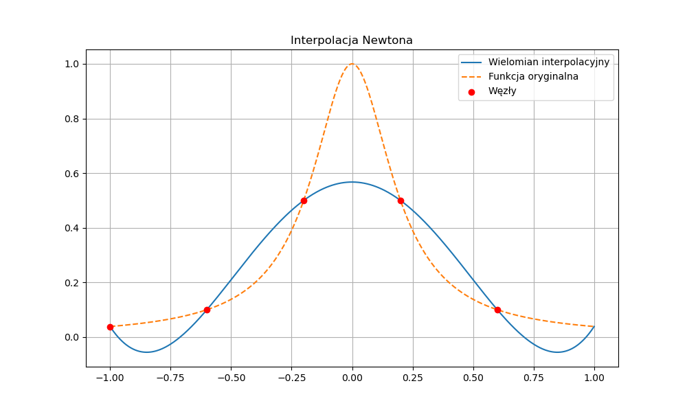
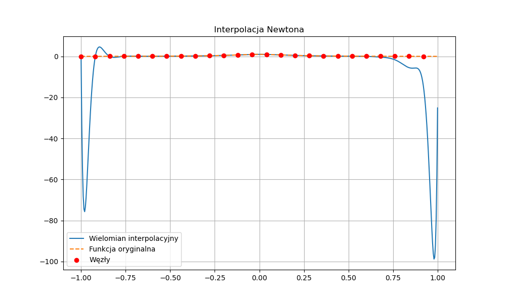

# Metody Numeryczne – Laboratoria

Repozytorium zawiera rozwiązania zadań laboratoryjnych z przedmiotu **Metody Numeryczne**.

---

## Spis treści

- [Struktura repozytorium](#struktura-repozytorium)
- [Laboratorium 01 – Interpolacja Lagrange'a](#laboratorium-01--interpolacja-lagrangea)
- [Laboratorium 02 – Interpolacja Newtona](#laboratorium-02--interpolacja-newtona)
- [Narzędzia pomocnicze](#narzędzia-pomocnicze)
- [Wymagania i kompilacja](#wymagania-i-kompilacja)

---

## Struktura repozytorium

```
metody_numeryczne_laby/
├── 01/                          # Laboratorium 1: Interpolacja Lagrange'a
│   ├── main.cpp                 # Zadanie 1 – interpolacja z pliku
│   ├── pierwiastek.cpp          # Zadanie 2 – przybliżenie ∛50
│   ├── dane.txt                 # Dane wejściowe (węzły interpolacji)
│   ├── sprawozdanie.md          # Sprawozdanie z laboratorium
│   └── *.png                    # Wykresy i zrzuty ekranu
│
├── 02/                          # Laboratorium 2: Interpolacja Newtona
│   ├── main.cpp                 # Zadanie 1 – ilorazy różnicowe Newtona
│   ├── dane.txt                 # Przykładowe dane (funkcja x²)
│   ├── dane_1.txt               # Dane testowe (5 punktów)
│   └── zad_2/
│       ├── main.cpp             # Zadanie 2 – interpolacja funkcji Rungego
│       ├── main.py              # Wizualizacja wyników (Python)
│       ├── wspolczynniki.txt    # Wyliczone współczynniki wielomianu Newtona
│       └── *.png                # Wykresy interpolacji
│
└── utils/
    └── import_from_file.cpp     # Biblioteka pomocnicza do odczytu plików
```

---

## Laboratorium 01 – Interpolacja Lagrange'a

### Zadanie 1 – Interpolacja z pliku

Program wczytuje węzły interpolacji z pliku `dane.txt` i oblicza wartość wielomianu interpolacyjnego Lagrange'a w punkcie podanym przez użytkownika.

**Wzór:**

$$L(x) = \sum_{i=0}^{n-1} f(x_i) \prod_{\substack{j=0 \\ j \neq i}}^{n-1} \frac{x - x_j}{x_i - x_j}$$

**Przykładowe dane wejściowe (`dane.txt`):**

```
4 2
-4.0 5.0
-3.0 2.0
 1.0 5.0
 2.0 2.0
```

**Przykładowy wynik:**

```
=== Lagrange Interpolation ===
Number of nodes: 4

Interpolation data:
x[0] = -4.0000, f(x[0]) = 5.0000
x[1] = -3.0000, f(x[1]) = 2.0000
x[2] =  1.0000, f(x[2]) = 5.0000
x[3] =  2.0000, f(x[3]) = 2.0000

Enter point x: f(0.5000) = 5.281250
```

### Zadanie 2 – Przybliżenie ∛50

Program wyznacza przybliżoną wartość $\sqrt[3]{50}$ metodą interpolacji Lagrange'a, korzystając z węzłów opartych na sześcianach liczb naturalnych:

| i | $x_i$ | $f(x_i) = \sqrt[3]{x_i}$ |
|---|--------|---------------------------|
| 0 | 27     | 3                         |
| 1 | 64     | 4                         |
| 2 | 125    | 5                         |
| 3 | 216    | 6                         |

**Wynik:**

| Wartość               | Wynik    |
|-----------------------|----------|
| Interpolacja Lagrange | 3.665882 |
| Wartość dokładna      | 3.684031 |
| Błąd bezwzględny      | ~0.018   |

### Kompilacja i uruchomienie

```bash
cd 01

# Zadanie 1
g++ -o zad1 main.cpp -std=c++11
./zad1

# Zadanie 2
g++ -o zad2 pierwiastek.cpp -std=c++11
./zad2
```

---

## Laboratorium 02 – Interpolacja Newtona

### Zadanie 1 – Ilorazy różnicowe Newtona

Program wczytuje węzły interpolacji i buduje tablicę ilorazów różnicowych, a następnie oblicza wartość wielomianu Newtona w zadanym punkcie.

**Wzór:**

$$W_n(x) = f[x_0] + f[x_0,x_1](x-x_0) + f[x_0,x_1,x_2](x-x_0)(x-x_1) + \cdots$$

gdzie ilorazy różnicowe obliczane są rekurencyjnie:

$$f[x_i,\ldots,x_{i+k}] = \frac{f[x_{i+1},\ldots,x_{i+k}] - f[x_i,\ldots,x_{i+k-1}]}{x_{i+k} - x_i}$$

### Zadanie 2 – Interpolacja funkcji Rungego

Program interpoluje klasyczną funkcję Rungego:

$$f(x) = \frac{1}{1 + 25x^2}, \quad x \in [-1, 1]$$

Algorytm generuje równoodległe węzły w przedziale $[-1, 1]$, oblicza współczynniki wielomianu Newtona (zapisywane do `wspolczynniki.txt`), a skrypt Pythona wizualizuje wyniki.

**Przykładowe wykresy** (5 i 25 węzłów):

| 5 węzłów | 25 węzłów |
|----------|-----------|
|  |  |

### Kompilacja i uruchomienie

```bash
# Zadanie 1
cd 02
g++ -o newton main.cpp -std=c++11
./newton

# Zadanie 2 – generowanie współczynników
cd zad_2
g++ -o wspolczynniki main.cpp -std=c++11
./wspolczynniki

# Zadanie 2 – wizualizacja (wymaga Python 3 z numpy i matplotlib)
python3 main.py
```

---

## Narzędzia pomocnicze

### `utils/import_from_file.cpp`

Biblioteka nagłówkowa w C++ udostępniająca funkcje do odczytu i zapisu danych:

| Funkcja | Opis |
|---------|------|
| `utils::read_typed_file(path)` | Wczytuje węzły interpolacji w formacie `n m` + pary `x y` |
| `utils::read_doubles(path)` | Wczytuje liczby zmiennoprzecinkowe (jedna na linię) |
| `utils::read_lines(path)` | Wczytuje plik linia po linii |
| `utils::read_matrix(path, delim)` | Wczytuje macierz z pliku tekstowego |
| `utils::write_doubles(path, values)` | Zapisuje wektor liczb do pliku |

**Format pliku wejściowego:**

```
n m         ← liczba węzłów (n) i liczba kolumn (m, zwykle 2)
x_0 y_0
x_1 y_1
...
x_{n-1} y_{n-1}
```

---

## Wymagania i kompilacja

### Wymagania

| Narzędzie | Wersja |
|-----------|--------|
| g++ / GCC | 4.8.1+ (C++11) |
| Python    | 3.6+   |
| numpy     | 1.14+  |
| matplotlib| 2.0+   |

### Instalacja zależności Pythona

```bash
pip install numpy matplotlib
```

### Ogólne zasady kompilacji

```bash
g++ -o <nazwa_wyjściowa> <plik_źródłowy>.cpp -std=c++11
```
